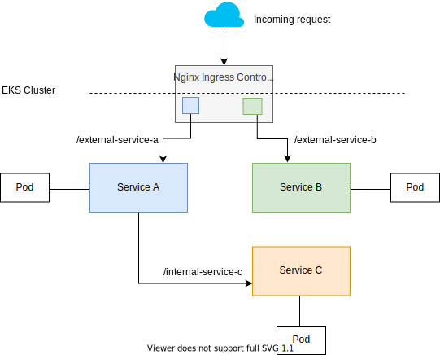

# Run EKA infrastructure & services on top Kubernetes in AWS

You can run all of your workload on top of EKS in AWS. Follow the steps below to run an EKS cluster using Terraform.
To manage external access to your services Nginx ingress controller for Kubernetes will be used.

## Architecture



## Provision your EKS Cluster

Provision an EKS cluster on AWS using Terraform

* Install aws-cli

```shell
brew install awscli
```

* After installing the AWS CLI. Configure it to use your credentials.

```shell
$ aws configure
AWS Access Key ID [None]: <YOUR_AWS_ACCESS_KEY_ID>
AWS Secret Access Key [None]: <YOUR_AWS_SECRET_ACCESS_KEY>
Default region name [None]: <YOUR_AWS_REGION>
Default output format [None]: json
```

**NOTE**: The above AWS IAM user must have [AmazonEKSAdminPolicy](https://docs.aws.amazon.com/eks/latest/userguide/security_iam_id-based-policy-examples.html) granted to be able to provision the EKS cluster below.

This enables Terraform access to the configuration file and performs operations on your behalf with these security credentials.

* Next, create an [S3 repo](main.tf#3) as that will be used to store the state of infrsatructure which will be provisioned below.

After you've done this, initalize your Terraform workspace, which will download 
the provider and initialize it with the values provided in the `terraform.tfvars` file.

```shell
$ terraform init
Initializing modules...
Downloading terraform-aws-modules/eks/aws 9.0.0 for eks...
- eks in .terraform/modules/eks/terraform-aws-modules-terraform-aws-eks-908c656
- eks.node_groups in .terraform/modules/eks/terraform-aws-modules-terraform-aws-eks-908c656/modules/node_groups
Downloading terraform-aws-modules/vpc/aws 2.6.0 for vpc...
- vpc in .terraform/modules/vpc/terraform-aws-modules-terraform-aws-vpc-4b28d3d

Initializing the backend...

Initializing provider plugins...
- Checking for available provider plugins...
- Downloading plugin for provider "template" (hashicorp/template) 2.1.2...
- Downloading plugin for provider "kubernetes" (hashicorp/kubernetes) 1.10.0...
- Downloading plugin for provider "aws" (hashicorp/aws) 2.52.0...
- Downloading plugin for provider "random" (hashicorp/random) 2.2.1...
- Downloading plugin for provider "local" (hashicorp/local) 1.4.0...
- Downloading plugin for provider "null" (hashicorp/null) 2.1.2...

Terraform has been successfully initialized!
```

Then, provision your EKS cluster by running `terraform apply`. This will 
take approximately 10 minutes.

```shell
$ terraform apply

# Output truncated...

Plan: 51 to add, 0 to change, 0 to destroy.

Do you want to perform these actions?
  Terraform will perform the actions described above.
  Only 'yes' will be accepted to approve.

# Output truncated...

Apply complete! Resources: 51 added, 0 changed, 0 destroyed.

Outputs:

...truncated...

```

## Configure kubectl

To configure kubetcl, you need both [kubectl](https://kubernetes.io/docs/tasks/tools/install-kubectl/) and [AWS IAM Authenticator](https://docs.aws.amazon.com/eks/latest/userguide/install-aws-iam-authenticator.html).

The following command will get the access credentials for your cluster and automatically
configure `kubectl`.

```shell
$ aws eks --region <aws-region> update-kubeconfig --name <name-of-eks-cluster>
```

The
[Kubernetes cluster name](outputs.tf#L26)
and [region](outputs.tf#L21)
 correspond to the output variables showed after the successful Terraform run.

You can view these outputs again by running:

```shell
$ terraform output
```

## Deploy Nginx Ingress controller

Deploy [nginx ingress controller](https://kubernetes.github.io/ingress-nginx/) to manage external access to the services in the EKS cluster.

```shell
kubectl apply -f nginx-ingress-controller/*
```

You can now simply create a public API endpoint for your service via the Nginx controller with K8s annotations, for example:

```shell
apiVersion: networking.k8s.io/v1beta1
kind: Ingress
metadata:
  annotations:
    kubernetes.io/ingress.class: "nginx"
    nginx.ingress.kubernetes.io/rewrite-target: /$2
    nginx.ingress.kubernetes.io/use-regex: "true"
  name: client-registry-ingress-public
spec:
  rules:
  - host:
    http:
      paths:
      - path: /client-registry(/|$)(.*)
        backend:
          serviceName: client-registry
          servicePort: 8080
```

In the above example a public end-point for a service named client-registry will be created with the a URL like this: `http://aws-network-load-balancer-domain/client-registry`

And will proxy all the subsequent URI elements, i.e., after `/client-registry` to client-registry service API on port 8080.

Note: Such annotations should be create in the service's repository itself, together with service deployment. You may use helm or k8s YAML definition (as provided above).

## Deploy and access Kubernetes Dashboard

To verify that your cluster is configured correctly and running, you need to install a Kubernetes dashboard and navigate to it in your local browser. 

### Deploy Kubernetes Metrics Server

The Kubernetes Metrics Server, used to gether metrics such as cluster CPU and memory usage
over time, is not deployed by default in EKS clusters.

Download and unzip the metrics server by running the following command.

```shell
$ wget -O metrics-server.tar.gz https://codeload.github.com/kubernetes-sigs/metrics-server/tar.gz/v0.3.6 && tar -xzf metrics-server.tar.gz
```

Deploy the metrics server to the cluster by running the following command.

```shell
$ kubectl apply -f metrics-server-0.3.6/deploy/1.8+/
```

Verify that the metrics server has been deployed. If successful, you should see something like this.

```shell
$ kubectl get deployment metrics-server -n kube-system
NAME             READY   UP-TO-DATE   AVAILABLE   AGE
metrics-server   1/1     1            1           4s
```

### Deploy Kubernetes Dashboard

The following command will schedule the resources necessary for the dashboard.

```shell
$ kubectl apply -f https://raw.githubusercontent.com/kubernetes/dashboard/v2.0.0-beta8/aio/deploy/recommended.yaml

namespace/kubernetes-dashboard created
serviceaccount/kubernetes-dashboard created
service/kubernetes-dashboard created
secret/kubernetes-dashboard-certs created
secret/kubernetes-dashboard-csrf created
secret/kubernetes-dashboard-key-holder created
configmap/kubernetes-dashboard-settings created
role.rbac.authorization.k8s.io/kubernetes-dashboard created
clusterrole.rbac.authorization.k8s.io/kubernetes-dashboard created
rolebinding.rbac.authorization.k8s.io/kubernetes-dashboard created
clusterrolebinding.rbac.authorization.k8s.io/kubernetes-dashboard created
deployment.apps/kubernetes-dashboard created
service/dashboard-metrics-scraper created
deployment.apps/dashboard-metrics-scraper created
```

Now, create a proxy server that will allow you to navigate to the dashboard 
from the browser on your local machine. This will continue running until you stop the process by pressing `CTRL + C`.

```shell
$ kubectl proxy
```

You should be able to access the Kubernetes dashboard [here](http://127.0.0.1:8001/api/v1/namespaces/kubernetes-dashboard/services/https:kubernetes-dashboard:/proxy/).

```plaintext
http://127.0.0.1:8001/api/v1/namespaces/kubernetes-dashboard/services/https:kubernetes-dashboard:/proxy/
```

## Authenticate the dashboard

To use the Kubernetes dashboard, you need to provide an authorization token. 
Authenticating using `kubeconfig` is **not** an option. You can read more about
it in the [Kubernetes documentation](https://kubernetes.io/docs/tasks/access-application-cluster/web-ui-dashboard/#accessing-the-dashboard-ui).

Create Dashboard admin role based access policy

```shell
$ kubectl apply -f kubernetes-dashboard-admin.rbac.yaml
```

Generate the token in another terminal (do not close the `kubectl proxy` process).

```shell
$ kubectl -n kube-system describe secret $(kubectl -n kube-system get secret | grep admin-user-token | awk '{print $1}') 

Name:         admin-user-token-9hj..
Namespace:    kube-system
Labels:       <none>
Annotations:  kubernetes.io/service-account.name: admin-user
              kubernetes.io/service-account.uid: 39vsdv6e-dsad-40ed-bdsab..

Type:  kubernetes.io/service-account-token

Data
====
namespace:  11 bytes
token:      eyJhbGciOiJSUzI1NiIsImtpZCI6I...
```

Select "Token" on the Dashboard UI then copy and paste the entire token you 
receive into the 
[dashboard authentication screen](http://127.0.0.1:8001/api/v1/namespaces/kubernetes-dashboard/services/https:kubernetes-dashboard:/proxy/) 
to sign in. You are now signed in to the dashboard for your Kubernetes cluster.
